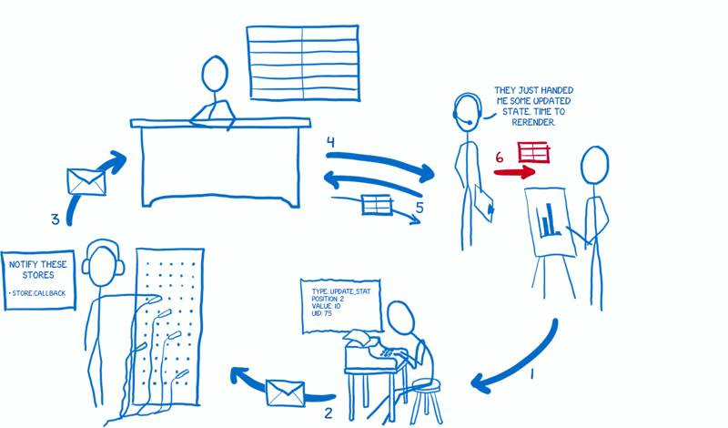

# Flux

***

## Flux ?  
Flux는 React를 공부하다보면 자연스레 접하게 될 것이다.  
React는 Facebook에서 개발된 UI Library로 기존의 프레임워크(혹은 라이브러리)들보다 가볍다.  
여기서 React를 라이브러리라고 말한 이유는 오로지 View(UI)만 담당하기 때문이다.  
웹에서 일반적으로 많이 사용되는 패턴인 MVC 패턴[^MVC]이 있다.  
React는 Model, Controller의 처리를 전혀 생각하지 않고 오로지 View에만 전념한다.  
즉, 데이터의 흐름이나 처리는 오로지 개발자의 책임이고 이로써 프레임워크는 경량화되었지만 데이터가 흐르는 수로는 없어지게 된 샘이다.  
이러한 데이터의 흐름(물길)을 제어하기 위해선 수로가 필요하게 될텐데, 결국 개발자들은 추가적인 라이브러리를 필요로 하게 되는데 그 중 가장 대표적인 아키텍처는 Flux이다.  
그리고 Flux를 구현한 라이브러리 중 대표적인 라이브러리는 Redux이다.  

[^MVC]: MVC 패턴은 Model, View, Controller의 첫 글자를 딴 약어로써 웹 어플리케이션의 전반적인 데이터의 흐름, 처리, 출력 등을 통틀어서 일련의 패턴을 말한다.  

***

## Flux와 Redux  
결론부터 말하자면 Flux는 개념/이론, Redux는 구현물/라이브러리이다.  
Redux는 Flux를 100% 구현한 것은 아니며, Flux를 기본으로 하되 좀 더 발전적인 모습으로 구현되었다.  
자세한 이해를 위해서는 아래의 Reference 사이트를 방문하여 정독하길 바란다. 

아래는 내가 이해한 Flux의 개념을 설명해보았다.  
1. Action  
: 사용자와 뷰가 상호작용(Interaction)을 하게 되고 이때 뷰가 데이터를 변경하기 위한 요청.  
2. Action Creator  
: 액션을 만들어내고 디스패처로 전달하는 도구.  
3. Dispatcher  
: 액션이 왔을 때 어떤 스토어로 전달되야 하는지 정해주는 결정자.  
4. Store  
: 데이터를 관리하는 저장소.  
데이터는 여러 뷰에 연관되어 있다.  
5. Controller View  
: 뷰를 관리하는 뷰.  
6. View  
: 말 그대로 뷰, 화면.  

### 구독-발행(Subscribe-Publish) 패턴  
신문(Newspaper)에 대한 구조를 생각하면 해당 패턴을 이해하는데 도움이 된다.  
사용자는 신문사에게 구독을 요청하고, 신문사는 자신들의 신문을 발행하여 구독중인 사용자들에게 전달하는 구조이다.  

### 준비과정  
Store (Subscribe)-> Dispatcher  
Controller View (Subscribe)-> Store  

### 데이터 흐름  
1. User -> View -> Action Creator  
: 사용자와 뷰의 상호작용으로 데이터 변경이 필요.  데이터 변경을 위한 액션 생성.  
2. Action Creator -> Dispatcher  
: 데이터를 알맞게 정제하고 디스패처로 전달.  
3. Dispatcher (Publish)-> Store  
: 구독(Subscribe)하고 있는 스토어에게 액션을 전달.  
4. Store (Publish)-> Controller View
: 구독(Subscribe)하고 있는 컨트롤러 뷰에게 데이터 변경이 일어났다고 알림.  
5. Controller View -> Store
: 컨트롤러 뷰는 변경된 데이터를 요청.  
6. Controller View -> View  
: 컨트롤러 뷰는 자신의 모든 뷰에게 새로운 데이터에 맞추어 다시 렌더링 하도록 알림.  

> Flux로의 카툰 안내서(데이터 흐름)

***

## Reference
1. [Flux로의 카툰 안내서](https://bestalign.github.io/2015/10/06/cartoon-guide-to-flux/)  
2. [Redux로의 카툰 안내서](https://bestalign.github.io/2015/10/26/cartoon-intro-to-redux/)  

***
