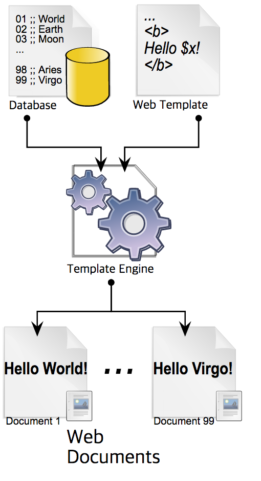
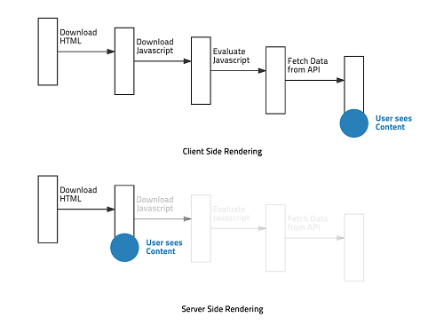

# Template Engine

***

## 배경지식
Java, JSP, Spring

***

## Template Engine ?  
템플릿 엔진(Template Engine)이란 동적으로 정적 웹 리소스(HTML)를 생성하는 도구이다.  
최초에 웹은 서버 사이트에서 정적 리소스만으로 잘 사용되었다.  
하지만 정적 리소스의 데이터를 수정하기 위해서는 번거롭고 시간도 많이 소요된다.  
즉 이러한 정적 리소스의 재생산 과정의 편리함, 생산성 향상을 위한 도구가 바로 템플릿 엔진이다.  
  
  

### 템플릿 엔진의 종류  
템플릿 엔진은 여러 종류가 있고 서버 사이드, 클라이언트 사이드 등 목적에 맞게 사용하는 것이 중요하다.  
Mustach, Handlebars, Thymeleaf, Freemarker, Jade 등.  

### Server Side, Client Side  
서버 사이드와 클라이언트 사이드의 구분은 렌더링 시점이다.  
과거 서버 사이드 렌더링은 정적 리소스를 만들어두고 HTTP 통신으로 클라이언트로 다운로드 후 웹 브라우저를 통해 보여주는 방식이었다.  
클라이언트 사이드 렌더링도 정적, 동적 리소스를 클라이언트에 전달 후 동적으로 화면을 구성(렌더링)한다.  
즉, 자바스크립트의 Ajax 같은 기술을 통해 데이터를 받아오고 동적으로 화면에 반영하게 된다.  
사용자는 미리 구성된 화면을 보는 것이 아니라 실시간으로 구성된 화면을 보는 것이다.  

클라이언트 사이드가 좀 더 발전적이라고 보여질 수 있지만 통상적으로 서버 사이드와 같이 사용된다.  
최근 유행인 SPA(Single Page Application)의 경우 최초 리소스를 받아올 때 페이지 전체를 받아온다.  
즉, 로딩이 발생하는데 속도 최적화를 위해 최초 페이지는 서버 사이드에서 렌더링되어 보낼 수 있다.  
이후 동작은 클라이언트 사이드에서 렌더링되므로 서버와 클라이언트 렌더링은 적절하게 사용하는 것이 중요하다.   

***

## Reference  
1. [웹 템플릿 엔진](https://nesoy.github.io/articles/2017-03/web-template)

***
